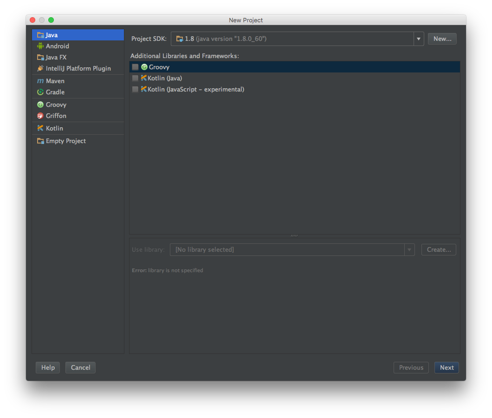
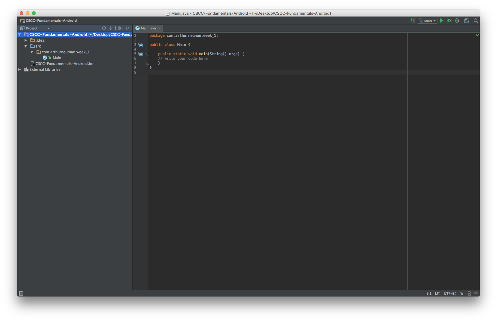
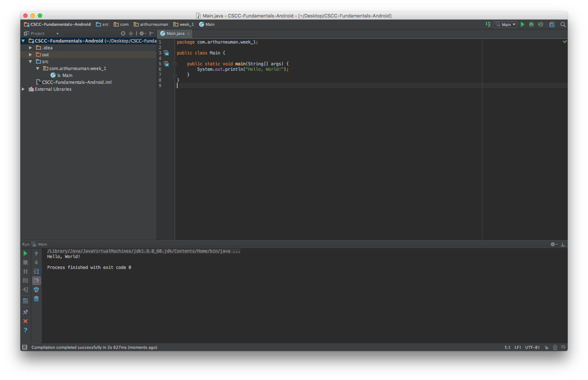
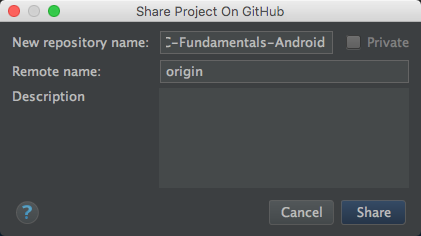
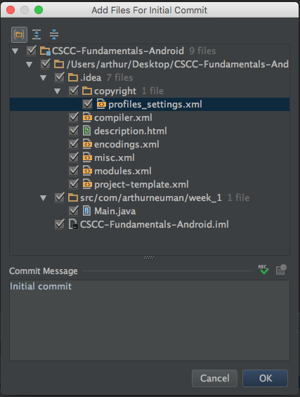

# Week 1 - Utilize Data

## Corresponding Text
*Learn Java for Android Development*, pp. 1-11, 37-70

## IntelliJ IDEA Java IDE
IntelliJ IDEA Community Edition is a free integrated development environment
(IDE) providing useful features for Java programming.

If IntelliJ is not installed, it can be downloaded from the IntelliJ website:
https://www.jetbrains.com/idea/download.

Starting IntelliJ for the first time, we will be presented with the welcome
screen. From here, we can create a new project.


When creating a new Java project, be sure that Java is selected for the project
software development kit (SDK). If no SDK is selected, click the **New...**
button and IntelliJ should find the SDK automatically. If no SDK is available
the Java development kit (JDK) can be downloaded from Oracle's website:
http://www.oracle.com/technetwork/java/javase/downloads/index.html.



For our first projects, we won't need any additional libraries or frameworks,
so we can continue by clicking **Next**.

To start, we'll rely on the command line app template. Make sure **Create
project from template** is selected and click **Next**.

Now, we can give the project a title, choose where it will be saved, and name
the base package (we'll talk about packages in more detail later). For now,
the base package name should be something like *com.myname.week_1*. I've
chosen the following for my first project:


After clicking **Finish**, we should see the project layout on the left and
an editor on the right.



We can write Java code in the editor and run our programs from the IntelliJ IDE
itself. We can check that everything is working by entering the following code
in the editor. Make sure you replace `package com.myname.week_1` with what you
named your package.

    package com.myname.week_1;

    public class Main {

        public static void main(String[] args) {
            System.out.println("Hello, World!");
        }
    }

Now we should be able to run the code by pressing the Run/Play button in the
upper right corner. If everything is working, we should see a new pane appear
in the IntelliJ window with the `Hello, World!` text.



For now, most of our programs will appear very much like this program and we'll
eventually talk about the various line of code. One thing to note before we
continue is that `System.out.println()` is used to display data at the console.
We'll use this as we investigate Java. Lets explore variables and data types.

## Variables and Java Data Types
A **variable** is a named location in the computer's memory used to
conveniently store a value. The type of data stored in a variable is
determined by the variable's data type. A **data type** is a classification of
data items and specifies its possible values. Java has eight primitive data
types. A primitive data type is a type whose values are not objects, which we
will discuss later. The eight primitive data types are
- **boolean**: has only two possible values: true and false
- **char**: a single Unicode character such as "A", "z", "5", or "%" with
  integer value between 0 and 65,535
- **byte**: an integer value between -128 and 127, uses 8 bits of memory
- **short**: an integer value between -32,786 and 32,767, uses 16 bits of
  memory
- **int**: an integer value between -2,147,483,648 and 2,147,483,647, uses
  32 bits of memory
- **long**: an integer value between -9,223,372,036,854,775,808 and
  9,223,372,036,854,775,807, uses 64 bits of memory
- **float**: a 32 bit value used to represent numbers with fractional parts
- **double**: a 64 bit value used to represent numbers with fractional parts

It is important to note that floats and doubles are floating point data types.
While floating point values are useful for representing numbers with fractional
parts, on computers there is a limit to how many decimal places can be
accurately represented.

In addition to the primitive data types there are user-defined types. We will
talk about user-defined types more later. There is one commonly used
user-defined type, String, that we'll use now but explore further later. The
**String** data type is used to store a sequence of characters.

User-defined types are also known as reference types. A variable with a
**reference type** stores a reference, a memory address, to the location in
memory that stores the value of the type. A primitive type stores the value
directly. For example, if *3* is assigned to a variable of type *int*, the
variable stores *3*. However, if the string *hello* is stored in a variable
of type *String*, the string *hello* is stored somewhere in the computer's
memory and the address of that location is stored in the variable.

### Creating variables and storing values
Recall that variables are named storage locations for data. Storing data and
accessing it later is important in nearly all computer programs. In Java,
a variable name can be any collection of letters, digits, "\_", or "$" as long
as it doesn't begin with a digit. Typically, variable names begin with a
letter and describe the value being stored.

Variables must be declared before they can be used. To declare a variable, we
must specify at least the variables data type and it's name. The following are
examples of variables being declared.

```
float temperature;
int zipCode;
boolean isRaining;
String city;
```

We've declared four variables: one named *temperature* that will have a float
value, one named *zipCode* that will store an integer, one named *isRaining*
that will store a boolean value (true or false), and one named *city* that can
be used to store a String (a sequence of characters). Note that we had to end
each declaration with a semicolon (;).

Suppose we wanted to declare several variables of the same type. We could
write something like this:

```
float temperature;
float humidity;
float pressure;
```

With Java, however, we can declare multiple variables of the same type at once.
Rather than write three separate lines, we can declare our three variables on
one line like this:

```
float temperature, humidity, pressure;
```

In addition to using a variable to store a single value of a type, we can use
a single variable to store multiple values of a type. **Array types** are
reference types that allow us to store values in equal-sized, contiguous
locations in memory. The individual values of an array are called
**elements**. Brackets, `[` and `]`, are used to declare arrays. For example,
we can declare an array of integers:

```
int[] dailyHighs;
```

In this example, we declared a one-dimensional array of integers. Notice that
we can place the brackets next to the type or the variable.
Typically, we'll see the brackets placed next to the type unless multiple
variables are being declared like this:

```
float currentTemperature, forecastHighs[], forecastLows[];
```

The following is a syntactically valid Java program consisting only of
variable declarations:

```
package com.myname.week_1;

public class Main {
    public static void main(String[] args) {
        float temperature, humidity, pressure;
        int zipCode;
        boolean isRaining;
        String city;
        int[] dailyHighs;
    }
}
```

We could copy this into IntelliJ and run it. The program doesn't do much.
So far, we've declared variables but haven't assigned any values to them.
Depending on the type, the declared variables will have a default initial value
or be uninitialized depending on the data types of the variables. We'll look at
this later. For now, let's look at assigning values to variables and working
with the variables.

### Expressions
In Java, an **expression** is a combination of literals, variable names, method
calls, and operators. A **literal** is a value expressed verbatim like *123*
or *"Hello"*. In Java, there are several kinds of literals: a character, a
string (a sequence of chacters), an integer, a floating-point value, the
boolean values *true* and *false*, and *null*. The *null* literal is used with
reference variables to indicate that the variable doesn't refer to an object.
We'll talk about operators soon and discuss method calls later.

The following are examples of literals.

| Data Type    | Examples                                     |
|:-------------|:---------------------------------------------|
| char         | '1', 'A', '?'                                |
| String       | "Hello", "Goodbye", "The weather is lovely." |
| int          | 1, -20, 1234                                 |
| float/double | 1, 2.0, 0.8392, -12923.1023                  |
| boolean      | true, false                                  |


A **simple expression** is an individual literal, variable name, or method
call (we'll discuss method calls more later). All of the example literals
above are examples are simple expressions.

A **compound expression** is a sequence of simple expressions and operators.
An **operator** is a symbolically represented instruction used to transform
data values, the operands, into another value. For example, `5  + 6` is a
compound expression consisting of two integer literals (5 and 6) and the
addition operator (+).

Java provides many operators. Operators can be classified by the number of
operands they take: a **unary operator** takes one operand, a **binary
operator** takes two operands, a **ternary operator** takes three operands, and
so on. Java has only one ternary operator, the rest are unary and binary.

Operators can also be classified based on their position relative to the
operands. **Prefix operators** appear before the operands (in -3, the -
operator is both an example a prefix and unary operator), **postfix operators**
appear after the operands (x++), and **infix operators** appear between two or
more operands (2 + 4).

While there are many operators that we'll work with, we'll start by focusing
on the arithmetic operators.

| Operator                      | Symbol | Description                                                             |
|:------------------------------|:-------|:------------------------------------------------------------------------|
| Addition/String concatenation | `+`    | Returns the sum of two numeric operands or the concatenation of strings |
| Division                      | `/`    | Returns the quotient of two numeric operands                            |
| Multiplication                | `*`    | Returns the product of two numeric operands                             |
| Subtraction                   | `-`    | Returns the difference of two numeric operands                          |
| Unary plus                    | `+`    | Returns the numeric operand                                             |
| Unary minus                   | `-`    | Returns the arithmetic negative of operand                              |
| Increment                     | `++`   | Add one to the operand, prefix and postfix operator                     |
| Decrement                     | `--`   | Subtract one from the operand, prefix and postfix operator              |

In addition to arithmetic operators there are a few more operators of interest.
As we continue exploring Java, we'll discuss other operators.

| Operator            | Symbol                     | Description                                                                                                                                                                                                    |
|:--------------------|:---------------------------|:---------------------------------------------------------------------------------------------------------------------------------------------------------------------------------------------------------------|
| Array index         | `[]`                       | Given *variable[index]*, where *index* is an integer, return or store the value in *variable's* storage at index                                                                                               |
| Assignment          | `=`                        | Given *variable = operand*, store *operand* in *variable*                                                                                                                                                      |
| Compound Assignment | `+=`, `-=`, `*=`, `/=`     | Given *variable operator operand*, perform the operation using the existing value of *variable* and *operand*, store the result in *variable*                                                                  |
| Comparison          | `==`, `<`, '<=', '>', `>=` | Given *operand1 operator operand2*, compare both operands, return *true* or *false* depending on the comparison; includes equality, less than, less than or equal to, greater than, greater than or equal to | |
| Object Creation     | `new`                      | Given *new identifier[integer size]*, allocate a one-dimensional array of values with type *identifier*                                                                                                        |

Here's Java code that demonstrates some of these operators. This code contains
comments. Comments are not evaluated and serve to document code. In this
example, comments are preceded by two forward slashes, `//`. We're also using
`System.out.println()`; remember that this lets us print values to the console.

```
package com.myname.week_1;

public class Main {
    public static void main(String[] args) {
        //Initialize variables using the assignment operator
        int currentTemperature = 50;
        int tomorrowTemperature = 68;

        double currentHumidity = 0.55;
        double tomorrowHumidity = 0.68;

        String cityName = "Columbus";

        char fahrenheit = 'F';
        char celsius = 'C';

        //Addition
        System.out.println("Addition");
        System.out.println(currentTemperature + tomorrowTemperature); //two integers
        System.out.println("The current city is: " + cityName); //two strings
        System.out.println(fahrenheit + celsius);

        //Subtraction
        System.out.println("Subtraction");
        System.out.println(tomorrowHumidity - currentHumidity); //two floats

        //Unary plus and unary minus
        System.out.println("Unary plus and unary minus");
        System.out.println(+currentTemperature);
        System.out.println(-currentTemperature);
    }
}
```

If we run this program, the output should be:
```
Addition
118
The current city is: Columbus
137
Subtraction
0.13
Unary plus and unary minus
50
-50
```

For numerical values, the output is what we'd expect. With strings, the
addition operator results in a string that is the two operand strings joined
together. For characters, the operation is performed on the integer values
corresponding to the characters.

Lets looks at some more examples of operators.

```
package com.myname.week_1;

public class Main {
    public static void main(String[] args) {
        int currentTemperature = 50;
        int highTemperature = 68;
        double currentHumidity = 0.55;
        double highHumidity = 0.75;
        String cityName = "Columbus";

        //Compound assignment
        highHumidity += 0.1; //add to existing value
        currentHumidity /= 2; //divide existing value
        System.out.println(highHumidity);
        System.out.println(currentHumidity);

        //Unary increment and decrement
        int tomorrowHighTemperature = ++highTemperature; //prefix increment
        int tomorrowLowTemperature = currentTemperature--; //postfix decrement
        System.out.println(tomorrowHighTemperature);
        System.out.println(tomorrowLowTemperature);

        /*
        Comparison
        compare two numeric values; if the values are the same, isHigh will be true
        if the values are different, isHigh will be false
        */
        boolean isHigh = currentTemperature == highTemperature;

        //compare the content of two strings
        boolean isColumbus = cityName == "Columbus";
        System.out.println(isHigh);
        System.out.println(isColumbus);
    }
}
```

The output should be:
```
0.85
0.275
69
50
false
true
```

Notice that the value of *tomorrowLowTemperature* is the same value of
**currentTemperature**. The postfix increment and decrement unary operators
assign the current value to the variable on the left-hand side of the
assignment operator then perform the increment or decrement operation on the
operand variable on the right-hand side.

Finally, let's look at the array index operator. For this example, we'll
initialize an array with some values using braces.

```
package com.myname.week_1;

public class Main {
    public static void main(String[] args) {
        int[] forecastHighs = {50, 60, 55, 45, 30};

        //Display each element from the array
        System.out.println(forecastHighs[0]);
        System.out.println(forecastHighs[1]);
        System.out.println(forecastHighs[2]);
        System.out.println(forecastHighs[3]);
        System.out.println(forecastHighs[4]);

        //Replace the last value in the array
        forecastHighs[4] = 100;
        System.out.println(forecastHighs[4]);
    }
}
```

The output is:
```
50
60
55
45
30
100
```

In a previous example, we created an array using an integer literal to specify
the size and immediately assigned values to its elements. What if we didn't
have values at the time the array is declared? What if we wanted to use a
variable to specify the length?  We can use the *new* operator to do this. For
example, we can set the length of an array of strings using a variable with
an integer value and then assign values to each element in the array.

```
package com.myname.week_1;

public class Main {
    public static void main(String[] args) {
        int numberOfAnimals = 3;
        String[] animals = new String[numberOfAnimals];
        animals[0] = "cat";
        animals[1] = "dog";
        animals[2] = "chicken";

        System.out.println(animals[1]);
    }
}
```

The output is:
```
dog
```

With the assignment operator, the value on the right-hand side will be
evaluated before the value is stored in the variable on the left-hand side.
Pay special attention to the value that is being calculated on the right-hand
side and the type of the variable on the left-hand side.

Consider the following:

```
int sum = 2 + 3;
```

First, the values *2* and *3* are added and their sum, *5*, is stored in the
variable *sum*. Since *2* and *3* are integers, we expect their sum to be an
integer.

What happens in the following?

```
int quotient = 10 / 4
```

The value of quotient is *2*. If we were to divide 10 by 4 by hand, we would
see that the quotient is 2.5. Since the left hand side is an integer and 2.5
is not an integer, the value is truncated and the integer *2* is stored in
*quotient*.

## Using GitHub
For this class, we'll use GitHub to save and share our work.

### Git and GitHub
GitHub is built on Git, a version control system allowing us to keep track of
changes to your code at various points in time as snapshots. When working with
Git on your computer, there are three distinct stages in which data resides:
the working directory, the staging area, and the local repository. The working
directory is where data we are modifying exists; the working directory
consists of the files that we will make changes to as we develop our
programs. The staging area stores information about what data will be part of
the next snapshot we store. The repository is a store of all the snapshots
we've taken; we can use the repository to compare different snapshots and
even revert your data to the state it was in a previous snapshot.

A basic Git workflow consists of making changes to files in the working
directory, adding them to a new snapshot in the staging area, and committing
the snapshot to the repository. All this can take place on your own computer.
Git is also able to easily update a repository on another computer based on
changes you've made on your computer. GitHub can be used to host a remote
repository and we can push changes from our local repository to a GitHub
repository. Similarly, we can pull changes from a remote repository to your
local repository and into your working directory.

For a better overview of how Git works, try this Git tutorial:
https://try.github.io

If you don't have a GitHub account, go to https://github.com and create one.
We'll work with creating repositories from
within IntelliJ IDEA.

### Working with GitHub in IntelliJ IDEA
With our existing project, we can create a new repository by selecting
**View -> Import into Version Control -> Share Project on Github** from
the menu bar. If this is the first time using GitHub with IntelliJ, you will
be prompted to enter your Github credentials and an IntelliJ password.

You will be prompted to enter a repository name, a remote name, and a
description; leave the remote name set to *origin*.



After clicking **Share**, you will be prompted to select the files to add.
For now, we can add the default set of files.



Once we have committed our files to the local repository, we can push the
changes to the remote repository on GitHub by selecting **VCS -> Git -> Push**
from the menus. When we modify, add, or remove files in the future, we can
use the commit menu option; this combines steps of adding files to staging and
committing them to the local repository.

## Exercise
**Write a program that stores a city name as a string, the city's zip code as an
integer, and the high temperature for the next five days in an array. The
program should calculate the average high temperature for the next five days
and store the value in a variable. Finally, the program should display the
city name, the zip code, and the average high temperature.**

The average of a collection of values is the sum of all the values divided by
the number of values.

For example, if the city is Columbus; the zip code is 43215; and the high
temperatures for the next five days are 32, 25, 27, 40, and 45, the output of
the program might be:

```
City: Columbus
Zip Code: 43215
Average High Temperature 33.8
```

When computing the average high temperature, was the value stored as an
integer value or a floating-point value? What happens to the computed average
with either data type?

Be sure to commit your code and push it to GitHub.
