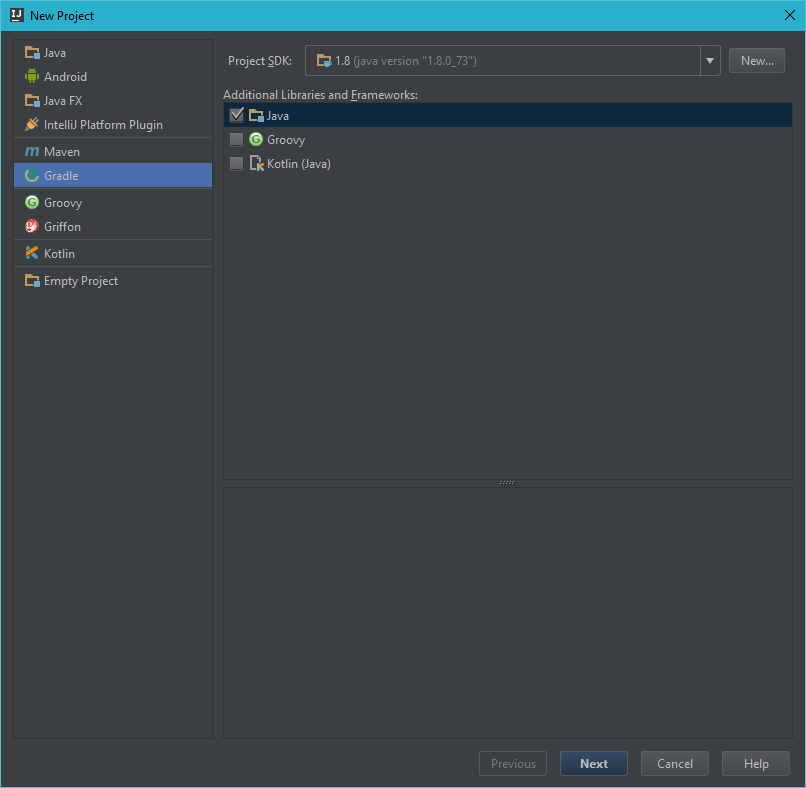
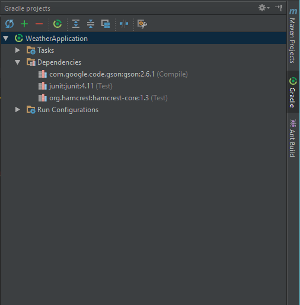
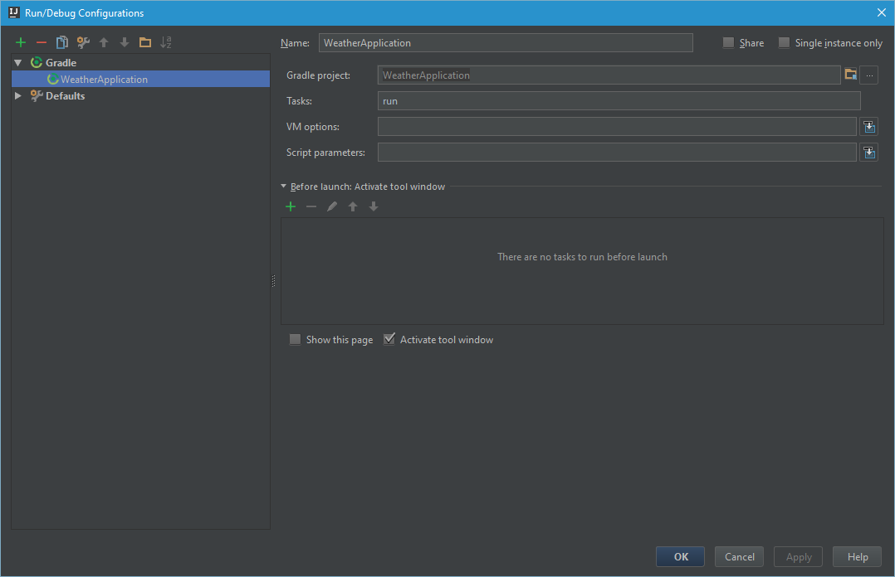

# Week 14 - JSON and Objects

## Corresponding Text
*Learn Java for Android Development*, pp. 205-217

## Using External Libraries with Gradle
Often when we want our programs to perform a complicated task, it's useful to
use a library or framework developed by someone else.  A **library** is a
collection of code implementing related behavior with a well defined interface
that is accessible to other code using the library.  

Many tools exist for managing the libraries we might want to use in our Java
code.  Among these are tools like Apache Maven and Gradle.  We'll use Gradle
to manage our programs' dependencies. In addition to managing dependencies,
Gradle is also manages how projects are built and packaged.

For the next two weeks topics, we'll work with a new IntelliJ project separate
from our other weekly code. When creating a new project IntelliJ, we can choose
to use Gradle by selecting *Gradle* as shown below. When specifying the
*Groupid* and *Artifactid*, you can use something similar to a package name
and project name, respectively.  



After creating the new project, you should see many Gradle-related files. We
can specify our program's dependencies by modifying *build.gradle*.  For the
work we'll be doing this week, we'll want to use the Gson library so your
*build.gradle* file will look similar to this:

```
group 'com.myname'
version '1.0-SNAPSHOT'

apply plugin: 'java'
apply plugin: 'application'
apply plugin: 'idea'

mainClassName = 'com.myname.Main'

repositories {
    mavenCentral()
}

dependencies {
    compile 'com.google.code.gson:gson:2.6.1'
    testCompile group: 'junit', name: 'junit', version: '4.11'
}

```

After updating the Gradle settings, refresh the Gradle project settings by
choosing *Gradle* from the right-hand toolbar and then clicking the refresh
icon.



If IntelliJ prompts you to enable refreshing the Gradle wrapper with sources,
enable the feature. If prompted to index remote respositories, click *Open
Repositories List"*, click the URL containing *http://repo1.maven.org*, and
click the *Update* button.

We'll have to create a folder to store our code.  Until now, we've been placing
all our code in a module or in a package inside a module.  The standard Java
directory structure that you'll often see, has source code appearing in
`src/main/java` - a *src* folder within the project, a *main* folder within
the *src* folder, and a *java* folder in the *main* folder.  Once we create
those folders, we can create a package and class files like usual.

When we create a run configuration for our project, rather than create a
new application configuration, we'll create a Gradle configuration with
settings similar to those below.



While we're setting up our project, lets create a *.gitignore* file.  The
following will exclude user-specific configuration files from our Git
repository.

```
## Gradle
.gradle
build/

# Ignore Gradle GUI config
gradle-app.setting

# Avoid ignoring Gradle wrapper jar file (.jar files are usually ignored)
!gradle-wrapper.jar

# Cache of project
.gradletasknamecache

# # Work around https://youtrack.jetbrains.com/issue/IDEA-116898
gradle/wrapper/gradle-wrapper.properties

## IntelliJ
# User-specific stuff:
.idea/workspace.xml
.idea/tasks.xml
.idea/dictionaries
.idea/vcs.xml
.idea/jsLibraryMappings.xml

# Sensitive or high-churn files:
.idea/dataSources.ids
.idea/dataSources.xml
.idea/dataSources.local.xml
.idea/sqlDataSources.xml
.idea/dynamic.xml
.idea/uiDesigner.xml

# Gradle:
.idea/gradle.xml
.idea/libraries

# Mongo Explorer plugin:
.idea/mongoSettings.xml

## File-based project format:
*.iws

## Plugin-specific files:

# IntelliJ
/out/
```

Now, if create a *Main* class file and add the following code, we should be
able to run the project.

```java
package com.myname;


public class Main {
    public static void main(String[] args) {
        System.out.println("Hello, world!");
    }
}
```

The output will be something similar to the following:

```
9:22:41 AM: Executing external task 'run'...
:compileJava UP-TO-DATE
:processResources UP-TO-DATE
:classes UP-TO-DATE
:run
Hello, world!

BUILD SUCCESSFUL

Total time: 0.286 secs
9:22:42 AM: External task execution finished 'run'.
```

The output includes information related to Gradle's build process but we can
see the output of our program as well.

## JSON

**JSON** is a language-independent data format used to exchange data using
human-readable text. JSON is based on JavaScript but can be used with any
language.  Often, JSON is used to send and receive data to/from another
program including a web server.

There are six basic data types that are representable in JSON:

1. *Number*: a signed, decimal number that may contain a fractional part,
2. *String*: a sequence of zero or more unicode characters delimited with
   double quotes,
3. *Boolean*: either *true* or *false*,
4. *Array*: an ordered list of zero or more values each of which can be of
   any type,
5. *Object*: an unordered collection of key/value pairs where the keys are
   strings, and
6. *null*: an empty value.

The following is an example of a JSON array containing both strings and
numbers:

```JSON
[10, "Hello", -4.32, "😀"]
```

Note that arrays are enclosed in square brackets (`[` and `]`) and elements
are separated by commas.

The following is an example of a JSON object:

```JSON
{
  "name": "columbus",
  "temperature": 70,
  "forecast": [70, 65, 82, 54, 60]
}
```

JSON objects are enclosed in curly brackets (`{` and `}`), names are strings
enclosed in double quotes, values are any JSON type, a key is separated from
a value using a colon, and key/value pairs are separated from one another using
commas.

##JSON in Java
Now that we've been introduced to JSON, we'd like to be able to use it in
Java.  For example, the next lecture will include examples of retrieving and
sending data from/to a website; we'll use JSON to to facilitate the transfer.

When working with JSON and other similar formats, we often describe the
process of converting data in our program to JSON as **serialization** or
**marshalling**. The process of converting JSON data into a data structure our
program can work with is known as **deserialization**. We'll look at
deserialization first.

For the following examples, we'll be working with the following JSON data or
some subset:

```JSON
[
    {
        "name":"columbus",
        "forecast":[40, 50, 65, 60, 70]
    },
    {
        "name":"cleveland",
        "forecast":[35, 55, 60, 45, 65]
    },
    {
        "name":"cincinnati",
        "forecast":[35, 60, 65, 45, 65]
    }
]
```

This data consists of a single JSON array where each element is a JSON object.
Each of the three JSON objects have two key/value pairs.  The first key/value
pair has a "name" key and a string value.  The second key/value pair has a
"forecast" key and an array of numbers as the corresponding value.  

### Deserialization
To start, JSON

```JSON
{
    "name":"columbus",
    "forecast":[40, 50, 65, 60, 70]
}
```

Forecast.class
```Java
package com.myname.week_14;

import java.util.ArrayList;
import java.util.List;

public class Forecast {
    private String name;
    private List<Double> forecast;

    public String getName() {
        return name;
    }

    public void setName(String name) {
        this.name = name;
    }

    public List<Double> getForecast() {
        return new ArrayList<>(forecast);
    }

    public void setForecast(List<Double> forecast) {
        this.forecast = forecast;
    }

    public String toString() {
        List<String> forecastStrings = new ArrayList<>();
        for (Double temp: forecast) {
            forecastStrings.add(temp.toString());
        }
        String forecastString = String.join(", ", forecastStrings);
        return String.format("The forecast for %s: is %s", name, forecastString);
    }
}
```

Don't need setters, Gson uses reflection.

Main.class:

```Java
package com.myname.week_14;

import com.google.gson.Gson;

public class Main {
    public static void main(String[] args) {
        String jsonData = "{'name': 'columbus', 'forecast': [40, 50, 65, 60, 70]}";

        Gson gson = new Gson();
        Forecast columbus = gson.fromJson(jsonData, Forecast.class);
        System.out.println(columbus);

    }
}
```

Many forecasts:

```Java
package com.myname.week_14;

import com.google.gson.Gson;

public class Main {
    public static void main(String[] args) {
        String jsonData = "[{'name': 'columbus', 'forecast': [40, 50, 65, 60, 70]}," +
                "{'name': 'cleveland', 'forecast': [35, 40, 55, 60, 65]}," +
                "{'name': 'cincinnati', 'forecast': [45, 50, 70, 65, 65]}]";

        Gson gson = new Gson();

        Forecast[] forecasts = gson.fromJson(jsonData, Forecast[].class);
        for (Forecast cityForecast: forecasts) {
            System.out.println(cityForecast);
        }
    }
}
```

Alternative:
```Java
package com.myname.week_14;

import com.google.gson.Gson;
import com.google.gson.reflect.TypeToken;

import java.lang.reflect.Type;
import java.util.ArrayList;
import java.util.List;

public class Main {
    public static void main(String[] args) {
        String jsonData = "[{'name': 'columbus', 'forecast': [40, 50, 65, 60, 70]}," +
                "{'name': 'cleveland', 'forecast': [35, 40, 55, 60, 65]}," +
                "{'name': 'cincinnati', 'forecast': [45, 50, 70, 65, 65]}]";

        Gson gson = new Gson();

        Type forecastListType = new TypeToken<ArrayList<Forecast>>(){}.getType();
        List<Forecast> forecasts = gson.fromJson(jsonData, forecastListType);

        for (Forecast cityForecast: forecasts) {
            System.out.println(cityForecast);
        }

    }
}
```

Another alternative using custom class:

ForecastCollection.class:

```Java
package com.myname.week_14;

import java.util.ArrayList;

public class ForecastCollection extends ArrayList<Forecast> {
}
```

Main.class:

```Java
package com.myname.week_14;

import com.google.gson.Gson;

public class Main {
    public static void main(String[] args) {
        String jsonData = "[{'name': 'columbus', 'forecast': [40, 50, 65, 60, 70]}," +
                "{'name': 'cleveland', 'forecast': [35, 40, 55, 60, 65]}," +
                "{'name': 'cincinnati', 'forecast': [45, 50, 70, 65, 65]}]";

        Gson gson = new Gson();

        ForecastCollection forecasts = gson.fromJson(jsonData, ForecastCollection.class);

        for (Forecast cityForecast: forecasts) {
            System.out.println(cityForecast);
        }

    }
}
```

### Serialziation

## Exercise
Task problem
